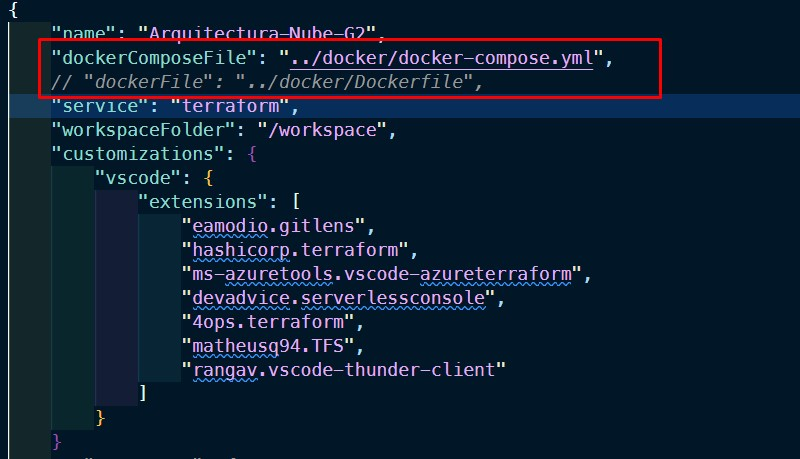
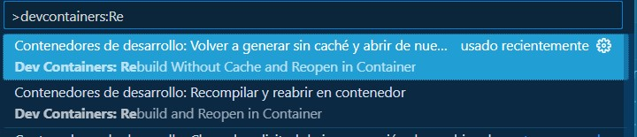

# CONFIGURACION PROYECTO GRUPO 2

- [CONFIGURACION PROYECTO GRUPO 2](#configuracion-proyecto-grupo-2)
  - [Objetivo](#objetivo)
  - [Consideraciones Iniciales](#consideraciones-iniciales)
  - [Configuracion DevContainer](#configuracion-devcontainer)
  - [Desplegar DevContainer](#desplegar-devcontainer)
  - [Despliegue de servicios](#despliegue-de-servicios)
    - [Localstack](#localstack)
    - [AWS](#aws)
## Objetivo

## Consideraciones Iniciales

Antes de inicializar el contenedor es necesario confirmar la instalacion de

- Docker https://docs.docker.com/engine/install/
- Localstack Desktop https://docs.localstack.cloud/user-guide/tools/localstack-desktop/
- Extension VScode Dev Containers https://marketplace.visualstudio.com/items?itemName=ms-vscode-remote.remote-containers

## Configuracion DevContainer

- Si deseas trabajar desplegando los servicios usando localstack dejar habilitada la opcion **`"dockerComposeFile": "../docker/docker-compose.yml"`** y comentar con **`#`** la opcion **`"dockerFile": "../docker/Dockerfile"`**
- Si deseas trabajar desplegando los servicios usando AWS dejar habilitada la opcion **`"dockerFile": "../docker/Dockerfile"`** y comentar con **`#`** la opcion **`"dockerComposeFile": "../docker/docker-compose.yml"`**
  

## Desplegar DevContainer

En VSCode se presentan dos opciones para despliegue DevContainer
- Presionado la tecla **`F1`** y en la barra del buscador digitar **`devcontainers:Rebuild and Reopening Container`**
 
- En la esquina inferior izquierda de VSCode click sobre el icono **`><`** y seleccionar la opcion **`Reopening Container`**
  

## Despliegue de servicios

Cuando ya se encuentre desplegado el devContainer, ir a la opcion del menu superior **`Terminal`** -> **`Nuevo Terminal`**


### Localstack

Dentro de la terminal encontraremos la carpeta **`localstack`** **`cd localstack`**
dentro de la misma encontraremos 3 subcarpetas

```
--localstack
  |
  |--orderManager
  |--pizzaHat
  |--ThaiLand
```

1. Desplegaremos los servicios que se encuentran en la carpeta **`orderManager`**
  - Emitiremos el comando **`terraform init`**, esperamos a que finalice el proceso de inicializacion(En caso de haberlo hecho previamente en la carpeta omitir este paso)
  - Emitiremos el comando **`terraform plan`**, validamos el resumen de recursos que seran desplegados
  - Emitiremos el comando **`terraform apply --auto-approve`**, realizara el despliegue la infraestructura
  
    **Nota:**
   - Tener presente que al finalizar el despligue nos arrojara por consola en la seccion de **`Outputs`** una variable llamada **`apiId`**, es requerido para las pruebas con el endpoint
    
  - Para validar que los servicios fueron desplegados correctamente, podremos hacer uso de `Localstack Desktop`
    
    
    
  - En la terminal retornamos a la carpeta **`/workspace/localstack`** con el comando **`cd ..`**
2. Desplegaremos los servicios que se encuentran en la carpeta **`pizzaHat`**
  - Emitiremos el comando **`terraform init`**, esperamos a que finalice el proceso de inicializacion(En caso de haberlo hecho previamente en la carpeta omitir este paso)
  - Emitiremos el comando **`terraform plan`**, validamos el resumen de recursos que seran desplegados
  - Emitiremos el comando **`terraform apply --auto-approve`**, realizara el despliegue la infraestructura
  - Al igual que el anterior paso validaremos que los servicios fueron desplegados mediante el uso de uso de **`Localstack Desktop`**
  - En la terminal retornamos a la carpeta **`/workspace/localstack`** con el comando **`cd ..`**
3. Desplegaremos los servicios que se encuentran en la carpeta **`thaiLand`**
  - Emitiremos el comando **`terraform init`**, esperamos a que finalice el proceso de inicializacion(En caso de haberlo hecho previamente en la carpeta omitir este paso)
  - Emitiremos el comando **`terraform plan`**, validamos el resumen de recursos que seran desplegados
  - Emitiremos el comando **`terraform apply --auto-approve`**, realizara el despliegue la infraestructura
  - Al igual que el anterior paso validaremos que los servicios fueron desplegados mediante el uso de uso de **`Localstack Desktop`**
  - En la terminal retornamos a la carpeta **`/workspace/localstack`** con el comando **`cd ..`**

Para realizar las peticiones al apigateway que fue creado en la infraestructura de **`orderManager`**, nos apoyaremos de la herramienta postman( o la herramienta de su preferencia)

- Le daremos a la opcion **`Add New Request`** con las siguientes opciones
  - Metodo: **`POST`**
  - URL: http://localhost:4566/restapis/**`apiID`**/prod/_user_request_/order
  - En la seccion **`BODY`** seleccionar **`raw`** **`JSON`**
  - Pegar el siguiente template
    ``` 
    {
    "restaurantName": "pizzaHat",
    "order": "peperoni",
    "customerName": "Pepito",
    "amount": "5"
    }
    ```
    
- Posterior en la opcion **`Send`** y debera reflejar en la salida
  
- Para validar los mensajes de las lambdas **`pizzaHat`** y **`thaiLand`**, iremos a **`localstack desktop`** en la opcion de servicios y seleccionaremos la lambda respectiva, posteriormente la opcion **`logs`** y por ultimo veremos los mensajes emitidos por cada una de las lambdas
  
  
  
  

### AWS